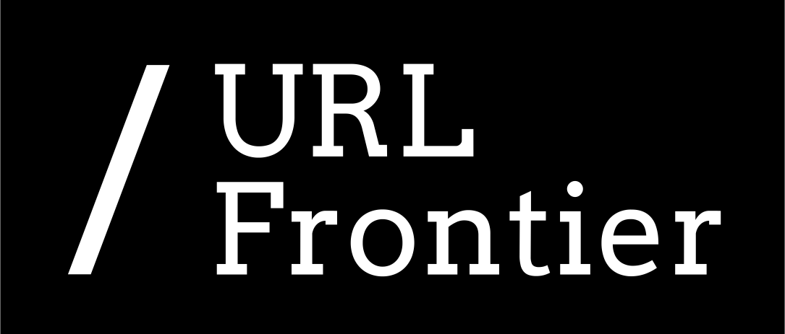

Discovering content on the web is possible thanks to web crawlers, luckily there are many excellent open-source solutions for this; however, most of them have their own way of storing and accessing the information about the URLs.

The aim of the *URL Frontier* project is to develop a crawler/language-neutral API for the operations that web crawlers do when communicating with a web frontier e.g. get the next URLs to crawl, update the information about  URLs already processed, change the crawl rate for a particular hostname, get the list of active hosts, get statistics, etc... Such an API can used by a variety of web crawlers, regardless of whether they are implemented in Java like [StormCrawler](http://stormcrawler.net) and [Heritrix](https://github.com/internetarchive/heritrix3) or in Python like [Scrapy](https://scrapy.org/).

The outcomes of the project are to:
- design an **[API](API/README.md)** with [gRPC](http://grpc.io), provide a Java stubs for the API and instructions on how to achieve the same for other languages
- deliver a robust reference implementation of the URL Frontier **[service](service/README.md)**
- implement a command line **[client](client/README.md)** for basic interactions with a service
- provide a **[test suite](tests/README.md)** to check that any implementation of the API behaves as expected

One of the objectives of URL Frontier is to involve as many actors in the web crawling community as possible and get real users to give continuous feedback on our proposals. 

Please use the [project mailing list](https://groups.google.com/g/crawler-commons) or [Discussions](https://github.com/crawler-commons/url-frontier/discussions) section for questions, comments or suggestions. 

There are many ways to [get involved](https://github.com/crawler-commons/url-frontier/wiki/Ways-to-help) if you want to.

This project is funded through the [NGI0 Discovery Fund](https://nlnet.nl/discovery), a fund established by NLnet with financial support from the European Commission's [Next Generation Internet programme](https://ngi.eu/), under the aegis of DG Communications Networks, Content and Technology under grant agreement No 825322. 

 

# License information

This project is available as open source under the terms of Apache 2.0. For accurate information, please check individual files.
