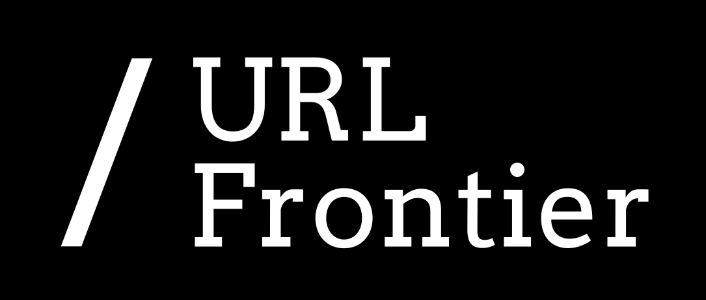

# URL Frontier

URL Frontier provides a crawler- and language-neutral API for the operations
web crawlers perform when interacting with a crawl frontier.

Different web crawlers have traditionally used their own approaches for
storing and accessing information about URLs. URL Frontier provides a common
API that crawlers can use regardless of their implementation language.

## What does URL Frontier provide?

The project provides:

- a gRPC API for interacting with a URL frontier;
- a reference URL Frontier service implementation;
- a command-line client for interacting with the service;
- a test suite for validating URL Frontier implementations.

## Main operations

URL Frontier supports common crawler frontier operations such as:

- retrieving URLs that are ready to crawl;
- adding newly discovered URLs;
- updating URLs that have already been processed;
- controlling crawl rates;
- managing queues and crawls;
- retrieving frontier statistics.

## Project components

The project is divided into several main components:

- **API** - the gRPC schema and generated Java API.
- **Service** - the reference implementation of the URL Frontier service.
- **Client** - a command-line client for interacting with a frontier.
- **Tests** - a test suite for verifying URL Frontier implementations.

## License

URL Frontier is available as open source under the terms of the
[Apache License 2.0](http://www.apache.org/licenses/LICENSE-2.0).

## Funding

This project is funded through the
[NGI0 Discovery Fund](https://nlnet.nl/discovery), a fund established by
NLnet with financial support from the European Commission's
[Next Generation Internet programme](https://ngi.eu/), under the aegis of
DG Communications Networks, Content and Technology under grant agreement
No 825322.
